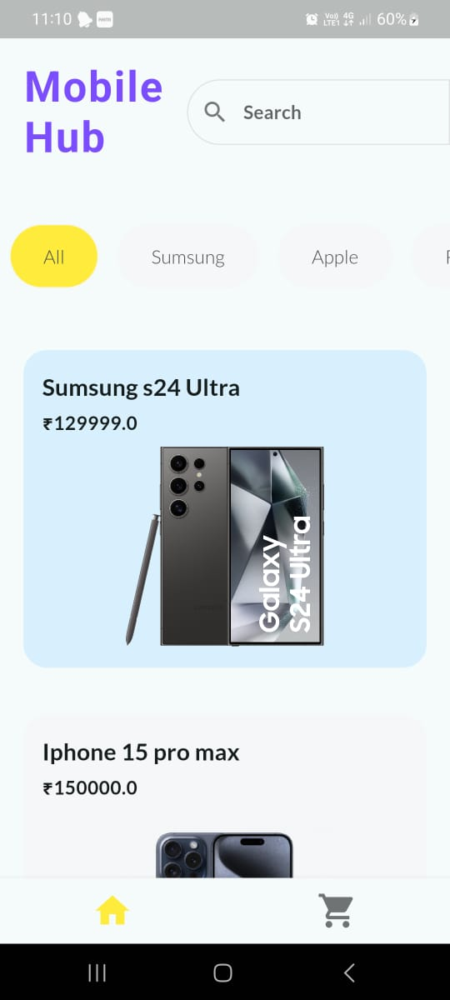
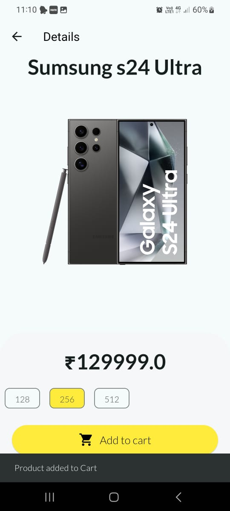
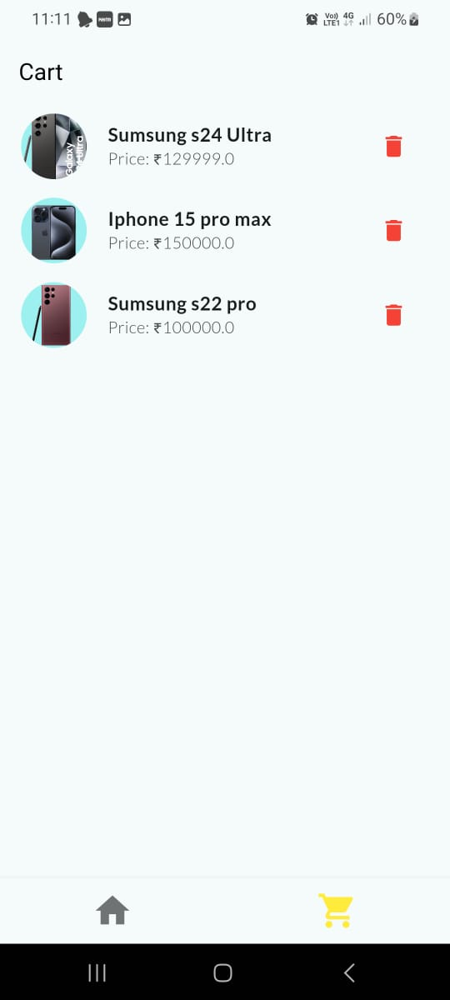

---

# Mobile Hub

Welcome to Mobile Hub, a sleek and user-friendly mobile application designed to provide a seamless shopping experience for mobile phones. This app offers a comprehensive product list, detailed product pages, and a shopping cart feature.

## Features

- **Product Listing**: Browse through a wide variety of mobile phones with detailed descriptions, prices, and images.
- **Product Details**: View detailed information about each product, including available sizes and colors.
- **Search Functionality**: Easily search for products using the search bar.
- **Filter Options**: Filter products by company to find exactly what you're looking for.
- **Shopping Cart**: Add products to your cart for a streamlined shopping experience.

## Screenshots





## Installation

To get started with the Mobile Hub app, follow these steps:

1. **Clone the repository:**
   ```bash
   git clone https://github.com/vvnserrao/mobile_hub_app.git
   ```

2. **Navigate to the project directory:**
   ```bash
   cd mobile_hub_app
   ```

3. **Install dependencies:**
   ```bash
   flutter pub get
   ```

4. **Run the app:**
   ```bash
   flutter run
   ```

## Usage

1. **Browse Products**: On the home screen, browse through the list of available mobile phones.
2. **Search**: Use the search bar at the top to quickly find specific products.
3. **Filter**: Apply filters by company to narrow down your search.
4. **View Details**: Tap on a product to view detailed information, including images, prices, and available sizes/colors.
5. **Add to Cart**: Add desired products to your cart and proceed to checkout.


   ```


---
